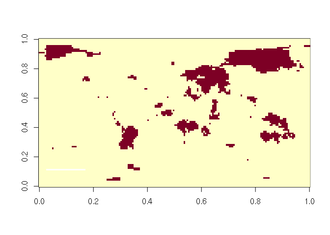
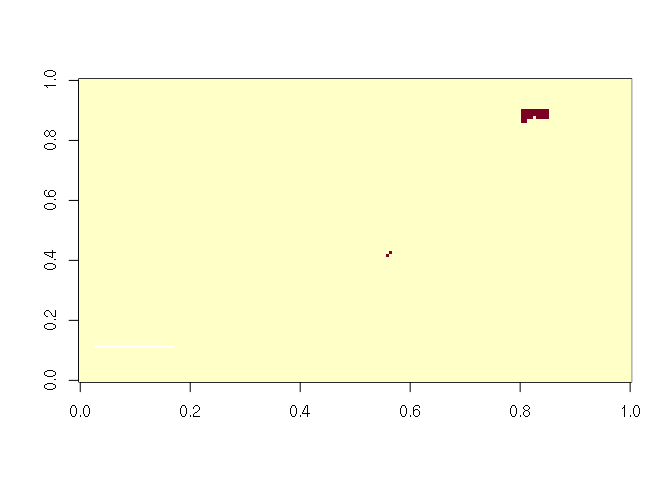

Introduction
============

Here we give an introduction to the package multiple testing in R! We do
a sample analysis and look at trends in gridded temperature data,
provided by NASA here:

<a href="https://data.giss.nasa.gov/pub/gistemp/GHCNv3/gistemp1200_ERSSTv5.nc.gz" class="uri">https://data.giss.nasa.gov/pub/gistemp/GHCNv3/gistemp1200_ERSSTv5.nc.gz</a>

The data in the package has been preprocessed so that we have yearly
averages in a 3d array with dimensions (lon, lat, t), where t is time.
We start by taking a quick look:

``` r
library(PerMuTe)
str(temp_gistemp)
#>  num [1:180, 1:90, 1:68] NaN NaN NaN NaN NaN NaN NaN NaN NaN NaN ...
#>  - attr(*, "dimnames")=List of 3
#>   ..$ lon: chr [1:180] "-179" "-177" "-175" "-173" ...
#>   ..$ lat: chr [1:90] "-89" "-87" "-85" "-83" ...
#>   ..$ t  : chr [1:68] "1951" "1952" "1953" "1954" ...
```

``` r
image(temp_gistemp[,,1])
```

 Our
objective is to determine **where** there are significant increasing or
decreasing trends. For this, we perform a trend test at each grid cell.
**Note** when doing this, we are repeating a test thousands of times and
the existance of false positives is **guaranteed**. Ideally, we want to
control the probability that our results have false positives. This
probability is what we control, at the desired *α*, when we apply a
correction for multiple testing.

The popular Bonferroni correction and related methods are **too
conservative** when performing thousands of tests, so we follow two
novel permutation methods which perform better. These methods are
described in:

> Cort'es, J., Mahecha, M., Reichstein, M. et al. Accounting for
> multiple testing in the analysis of spatio-temporal environmental
> data. Environ Ecol Stat 27, 293–318 (2020).
> <a href="https://doi.org/10.1007/s10651-020-00446-4" class="uri">https://doi.org/10.1007/s10651-020-00446-4</a>

Please use the above citation when using the code provided in this R
package.

Data and Methods
----------------

-   Gridded temperature data for the world, averaged yearly from
    1951-2018
-   Mann-Kendall trend test at each grid cell, at
    *α*<sub>*l**o**c**a**l*</sub> = 0.05  
-   Permutation correction for multiple testing, at
    *α*<sub>*g**l**o**b**a**l*</sub> = 0.05:
    -   Based on the maximum statistic (maxT)
    -   Based on the supra-threshold cluster size (STCS)

Note: there are two *a**l**p**h**a*’s above. The
*α*<sub>*l**o**c**a**l*</sub> controls the **individual** test’s
significance, while the *α*<sub>*g**l**o**b**a**l*</sub> controls the
**overall** probability of having a false positive. I recommend that
these two be equal to avoid any confusion in the interpretation of the
results.

The idea is to derive the distribution of maxT and STCS via
permutations. With these distributions we can establish thresholds to
control the overall false positives.

For each permutation method we do the following:

<table>
<colgroup>
<col style="width: 50%" />
<col style="width: 50%" />
</colgroup>
<thead>
<tr class="header">
<th>maxT</th>
<th>STCS</th>
</tr>
</thead>
<tbody>
<tr class="odd">
<td>Permute images</td>
<td>Permute images</td>
</tr>
<tr class="even">
<td>Calculate test statistic at each grid cell</td>
<td>Calculate test statistic at each grid cell</td>
</tr>
<tr class="odd">
<td>Keep the maximum statistic among all grid cells</td>
<td>Keep the size of the largest cluster of significant grid cells</td>
</tr>
<tr class="even">
<td>Repeat <strong>N</strong> times</td>
<td>Repeat <strong>N</strong> times</td>
</tr>
</tbody>
</table>

Where **N** is typically 1000. Because we are essentially repeating the
analysis **N** times, this can be time consuming. For the purposes of
this tutorial, we will set **N** to be 100.

The above is steps are what is already implemented for you in the
package.

R setup
-------

There are several inputs to the main function of the r package:
`multiple_testing correction`. We go over each of them briefly.

**data** The input data must be a 3d array, where the dimensions are
(lon, lat, t), in that order.

**fx** This is the desired function to be applied at each grid cell. You
need to specify your own function in R. This requires a little more
programming but allows for any type of analysis at the grid cell level.
Permutation methods are computationally expensive, so we try to keep the
function to its minimum requirements. A sample function to perform the
MK trend test with an adjustment for serial autocorrelation is included:

``` r
sample_mk_function
#> function(x){
#>   x <- x[is.finite(x)]
#>   xn <- (x[-1] - (x[-length(x)] * rk_fn(x)))
#>   z<- mk_z_stat(xn)
#>   return(z)
#> }
#> <bytecode: 0x8328c00>
#> <environment: namespace:PerMuTe>
```

**method** Which correction for multiple testing should be applied.
Defaults to all. Options are: c(“maxT”, “stcs”, “bonferroni”, “bh”,
“by”, “holmes”, “hochberg”)

**nperm** number of permutations to perform. Default to 1000, which is a
typical value. For testing the function a lower value is better, e.g.,
10.

**alpha\_local** significance level at each grid cell.

**alpha\_global** significance level for the overall study area

**null\_distribution** for bonferroni and related methods, a
distribution is needed to derive the p-values of the test statistics.
Supported options are “normal” and “t”. For example, the Mann-Kendall’s
S can be converted to a Z score, and so the distribution is “normal”.

**seed** set a seed to get same results every time.

**block\_size** length of block for performing block permutations.

**verbose** a counter that prints when it is done with every 10
permutations. Defaults to TRUE

Running the analysis
--------------------

Now that we have explained everything, lets run the analysis in R!

``` r
results<- multiple_testing_correction(data = temp_gistemp, 
                                      fx = sample_mk_function, 
                                      method = "all", 
                                      nperm = 10, 
                                      alpha_local = 0.10, 
                                      alpha_global = 0.10, 
                                      null_distribution = "normal")
#> starting permutations:
#> 10 
#> finished!
#> 
#> Summary of test statistic and p-values:
#> 
#>                   Min. 1st Qu. Median   Mean 3rd Qu.   Max. NA's
#> test_statistic -2.4677  1.8233 2.5109 2.3082  2.9330 4.8054   26
#> pval            0.0000  0.0034 0.0120 0.0931  0.0683 1.0000   26
#> 
#> 
#> Number of significant grid cells by multiple testing correction:
#> 
#>       method significant not significant
#>  uncorrected       13184            2990
#>         stcs       13167            3033
#>           bh       12812            3362
#>           by        2354           13820
#>         maxT         725           15449
#>       walker          31           16143
#>   bonferroni          30           16144
#>     hochberg          30           16144
#>         holm          30           16144
```

When verbose=TRUE, the function prints when it has completed multiples
of 10 permutations

In the results we have a named list of 2d matrices matching the lon, lat
dimensions of the input data. Each matrix corresponds to each specified
method, where each entry is TRUE or FALSE depending on whether or not it
is significant. The first two matrices are the test statistic at each
grid cell and their corresponding p-values.

The End!

Plotting results
----------------

To look at our data results we can do

``` r
image(results$test_statistic)
```


In the image above, darker shades of red indicated a more extreme test
statistic. In the images below, grid cells where significance is found
are shown in red.

``` r
image(results$maxT)
```



``` r
image(results$stcs)
```


Note that Bonferroni and other methods detect much less, for example:

``` r
image(results$bonf)
```



Now, we could continue the analysis with the selected grid cells, for
example, by estimating the slope at each of the selected grid cells and
summarizing by continent.

We end this intro with a nicer map:

``` r
#library(raster)
library(ggplot2)
library(sp)
library(sf)
#> Linking to GEOS 3.7.2, GDAL 2.4.2, PROJ 5.2.0
#library(rgeos)
library(maps)
library(reshape2)
# world <- ne_countries(scale = "medium", returnclass = "sf")
temperature_results_stcs<- melt(results$test_statistic)
spPoints<- SpatialPointsDataFrame(coords = data.frame(temperature_results_stcs[,1:2]),
                                  data = data.frame(mk_z=temperature_results_stcs$value),
                                  proj4string = CRS("+init=epsg:4326"))
polys<- as(SpatialPixelsDataFrame(spPoints,spPoints@data, tolerance = 0.149842),"SpatialPolygonsDataFrame")
polys_sf = as(polys, "sf")

library(maptools)
#> Checking rgeos availability: TRUE
borders  <- map("world", fill = T, plot = F)
IDs      <- seq(1,1627,1)
borders  <- map2SpatialPolygons(borders, IDs=borders$names, 
                               proj4string=CRS("+proj=longlat +datum=WGS84")) %>% 
            as("sf")
my_theme <- theme_bw() + theme(panel.ontop=TRUE, panel.background=element_blank())

ggplot(polys_sf) +
  geom_sf(aes(fill = mk_z), color = "transparent") + 
  geom_sf(data = borders, fill = "transparent", color = "black") +
  scale_fill_distiller(palette='Spectral') +
  ggtitle("Mann-Kendall's Z statistic") +
  #borders('world', colour='black')+
  coord_sf(crs = st_crs(4326), xlim = c(-180, 180), ylim = c(-90, 90))+
  my_theme 
```


The above map was generated following

<a href="https://stackoverflow.com/questions/43612903/how-to-properly-plot-projected-gridded-data-in-ggplot2" class="uri">https://stackoverflow.com/questions/43612903/how-to-properly-plot-projected-gridded-data-in-ggplot2</a>

The End!
